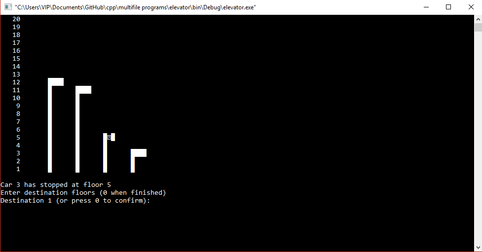

# elevator

This project simulates the working of elevators in the modern cities. Here I have simulated the working of four lifts in a 20 stoyered building.

The application runs on console and I have used Msoftcon library to stimulate a basic GUI right there in the console.

Open to your feedback and suggestions.

Special thanks to - Robert Lafore for his amazing book <i>Object-Oriented Programming in C++.</i> It helped me learn a lot without which it would have been quite a task to build this application.

* A Glimpse

